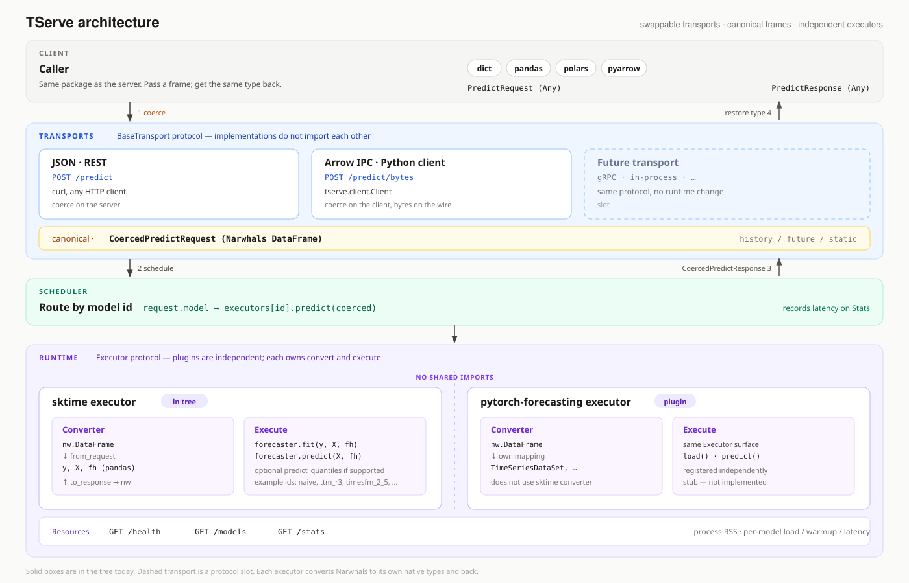

# TServe

| | **[Documentation](https://tserve.readthedocs.io/en/latest/)** · **[Quick start](https://tserve.readthedocs.io/en/latest/quick-start/)** · **[Models](https://tserve.readthedocs.io/en/latest/models/)** · **[API](https://tserve.readthedocs.io/en/latest/reference/http/)** |
| --- | --- |
| **Project** | [](https://github.com/sktime/tserve/blob/main/LICENSE) [](https://www.python.org/) [](https://pypi.org/project/tserve/) |
| **Status** | [](https://github.com/sktime/tserve/actions/workflows/test.yml) [](https://tserve.readthedocs.io/en/latest/?badge=latest) [](https://hub.docker.com/r/sktime/tserve) |

Time series serving for foundation models. You start a TServe process, name the models to load, and they stay in memory until the process stops.

A forecast is a request to that process. JSON goes to `POST /predict` from any HTTP client. The Python [`Client`](https://tserve.readthedocs.io/en/latest/client/python/#connect) posts Arrow to `POST /predict/bytes` and returns the same kind of table you sent: a dict, pandas, polars, or pyarrow. The dashboard at `GET /` plots a forecast in the browser. [What you can do](https://tserve.readthedocs.io/en/latest/server/dashboard/#what-you-can-do)

Chronos, TTM, TimesFM, Moirai, and the other families are in the [catalog](https://tserve.readthedocs.io/en/latest/models/#dependencies). `naive` loads with every process and needs no download, so you can check that the server answers before any checkpoint. [What gets loaded](https://tserve.readthedocs.io/en/latest/overview/#what-gets-loaded)



JSON is coerced on the server. The Python client coerces locally and restores your table type on the way back. Both paths reach the same loaded model. The fields on a request, and the path in the diagram: [Overview](https://tserve.readthedocs.io/en/latest/overview/) · [Request](https://tserve.readthedocs.io/en/latest/overview/#request). Images: [Docker Hub](https://hub.docker.com/r/sktime/tserve).

## First forecast

Docker is the short path. This image can load Chronos Bolt, Chronos T5, TTM, and TimesFM 2.x. The first start downloads the weights you name.

```bash
docker run --rm -p 8000:8000 sktime/tserve:hub chronos_bolt ttm_r3
```

When the log prints the local URLs, the models are warm. Five days of sales, three steps ahead:

```bash
curl -s http://127.0.0.1:8000/predict -H "Content-Type: application/json" -d '{
  "past": {
    "timestamp": ["2024-01-01", "2024-01-02", "2024-01-03", "2024-01-04", "2024-01-05"],
    "sales": [120, 135, 128, 142, 138]
  },
  "fh": 3,
  "model": "chronos_bolt"
}'
```

```json
{
  "predictions": {
    "timestamp": ["2024-01-06T00:00:00", "2024-01-07T00:00:00", "2024-01-08T00:00:00"],
    "sales": [139.96, 138.93, 138.26]
  },
  "quantiles": null,
  "model": "chronos_bolt",
  "request_id": "…"
}
```

Open [http://127.0.0.1:8000/](http://127.0.0.1:8000/), pick `chronos_bolt`, and plot the same series. The page can also take a pasted or dropped CSV. [What you can do](https://tserve.readthedocs.io/en/latest/server/dashboard/#what-you-can-do)

The same call from Python. The client posts Arrow, and `predictions` comes back as the same kind of table you sent:

```bash
pip install "tserve[client]"
```

```python
from tserve.client import Client

past = {
    "timestamp": ["2024-01-01", "2024-01-02", "2024-01-03", "2024-01-04", "2024-01-05"],
    "sales": [120, 135, 128, 142, 138],
}

with Client("http://127.0.0.1:8000") as client:
    result = client.predict(past=past, fh=3, model="chronos_bolt")

print(result.predictions)
```

The walkthrough, including `GET /models` and PowerShell: [Quick start](https://tserve.readthedocs.io/en/latest/quick-start/). A GPU host adds `--gpus all` and uses `sktime/tserve:hub-gpu`. [GPU images](https://tserve.readthedocs.io/en/latest/server/docker/#gpu-images)

## Models

117 checkpoints. The extra name is the image tag, `sktime/tserve:<tag>`, and `server` publishes as `:base`. GPU tags append `-gpu`. `base` has no GPU tag. **added** counts checkpoints that extra contributes. `full` is the total, including `naive`.

`naive` always loads, so you can try the process before any download. `GET /models` lists what this process loaded, which is smaller than the catalog. [What gets loaded](https://tserve.readthedocs.io/en/latest/overview/#what-gets-loaded)

| extra | families | added | example |
| --- | --- | ---: | --- |
| [`server`](https://tserve.readthedocs.io/en/latest/models/base/) | Naive | 1 | `naive` |
| [`hub`](https://tserve.readthedocs.io/en/latest/models/hub/) | Chronos Bolt, Chronos T5, TTM, TimesFM 2.x | 81 | `chronos_bolt` |
| [`chronos`](https://tserve.readthedocs.io/en/latest/models/chronos/) | Chronos-2 | 3 | `chronos_2` |
| [`kronos`](https://tserve.readthedocs.io/en/latest/models/kronos/) | Kronos, WindFM | 5 | `kronos` |
| [`granite`](https://tserve.readthedocs.io/en/latest/models/granite/) | FlowState | 2 | `flowstate` |
| [`moirai`](https://tserve.readthedocs.io/en/latest/models/moirai/) | Moirai 2, Moirai 1.x, Lag-Llama | 8 | `moirai_2` |
| [`tirex`](https://tserve.readthedocs.io/en/latest/models/tirex/) | TiRex | 2 | `tirex` |
| [`tirex2`](https://tserve.readthedocs.io/en/latest/models/tirex2/) | TiRex-2 | 4 | `tirex_2` |
| [`toto`](https://tserve.readthedocs.io/en/latest/models/toto/) | Toto-2 | 5 | `toto_2_0_4m` |
| [`mantis`](https://tserve.readthedocs.io/en/latest/models/mantis/) | Mantis | 3 | `mantis_8m` |
| [`timesfm3`](https://tserve.readthedocs.io/en/latest/models/timesfm3/) | TimesFM 3 | 1 | `timesfm_3` |
| [`t0`](https://tserve.readthedocs.io/en/latest/models/t0/) | T0 | 1 | `t0` |
| [`tafsut`](https://tserve.readthedocs.io/en/latest/models/tafsut/) | Tafsut | 1 | `tafsut` |
| [`full`](https://tserve.readthedocs.io/en/latest/models/full/) | all of the above | 117 | `chronos_2` |

`kronos` is built on `base`. Chronos Bolt, TTM, and TimesFM 2.x load on the images that include `hub`: `chronos`, `granite`, `moirai`, `tirex`, `tirex2`, `toto`, `mantis`, `timesfm3`, `t0`, `tafsut`, and `full`. TimesFM 3, TiRex-2, T0, and Tafsut load on their own extras and on `full`. Tags, GPU variants, and how the extras stack: [Dependencies](https://tserve.readthedocs.io/en/latest/models/#dependencies).

Each family page has its own start command. The catalog collects them under [Start a server](https://tserve.readthedocs.io/en/latest/models/#start-a-server). Switching images is the tag plus the example from that row:

```bash
docker run --rm -p 8000:8000 sktime/tserve:moirai moirai_2
```

Multivariate series, covariates, and quantiles differ by family: [Capabilities](https://tserve.readthedocs.io/en/latest/models/#capabilities). Every checkpoint name: [All models](https://tserve.readthedocs.io/en/latest/models/#all-models). `mantis` needs more than 127 rows of `past`: [mantis](https://tserve.readthedocs.io/en/latest/models/mantis/).

## Install

Docker needs no local Python. uv and pip need Python 3.12 or newer. Install the extra, or pull the tag, for the family in the table above.

- **Docker.** [Pull an image](https://tserve.readthedocs.io/en/latest/server/docker/#pull-an-image), then [run the server](https://tserve.readthedocs.io/en/latest/server/docker/#run-the-server). CPU and GPU are separate tags.
- **uv or pip.** [UV / Pip](https://tserve.readthedocs.io/en/latest/installation/#uv-pip). A PyPI install takes CUDA torch (MPS on macOS). A CPU wheel: [CPU-only install](https://tserve.readthedocs.io/en/latest/server/pip/#cpu-only-install).
- **A clone.** [From source](https://tserve.readthedocs.io/en/latest/installation/#from-source). On a clone, uv selects the torch index with the [`gpu` extra](https://tserve.readthedocs.io/en/latest/server/source/#gpu).

## Load a model

A bare `tserve` loads `naive` only. Name the models you want beside it. Flags are `--host`, `--port`, and `--log-level`: [Flags](https://tserve.readthedocs.io/en/latest/reference/cli/#flags) · [Startup and exit](https://tserve.readthedocs.io/en/latest/reference/cli/#startup-and-exit).

- **On the command line.** [Start](https://tserve.readthedocs.io/en/latest/server/#start) · [Serve from the command line](https://tserve.readthedocs.io/en/latest/server/pip/#serve-from-the-command-line)
- **From Python.** [`Server`](https://tserve.readthedocs.io/en/latest/server/pip/#serve-from-python) loads models before the port is bound. The same entry point from code: [Python entry point](https://tserve.readthedocs.io/en/latest/reference/cli/#python-entry-point).
- **In Docker, with a token and a weight cache.** [Hugging Face token](https://tserve.readthedocs.io/en/latest/server/docker/#hugging-face-token) · [Keep weights between runs](https://tserve.readthedocs.io/en/latest/server/docker/#keep-weights-between-runs) · [Choose which models to load](https://tserve.readthedocs.io/en/latest/server/docker/#choose-which-models-to-load)
- **An estimator you already built.** Pass `(id, estimator)`. Predict requests use that id as `model`. [Live objects](https://tserve.readthedocs.io/en/latest/server/live-objects/) · [Configured Hub estimators](https://tserve.readthedocs.io/en/latest/server/live-objects/#configured-hub-estimators)
- **A craft spec.** A class call with constructor kwargs and no imports. On the CLI it is `id=spec`. [From the command line](https://tserve.readthedocs.io/en/latest/server/craft-specs/#from-the-command-line) · [Rules](https://tserve.readthedocs.io/en/latest/server/craft-specs/#rules)
- **A saved sktime `.zip`.** [Save a model](https://tserve.readthedocs.io/en/latest/server/models-dir/#save-a-model) · [Load them](https://tserve.readthedocs.io/en/latest/server/models-dir/#load-them) · in Docker: [Models from a directory](https://tserve.readthedocs.io/en/latest/server/docker/#models-from-a-directory)

Startup prints the dashboard, Swagger, and ReDoc. [What you can do](https://tserve.readthedocs.io/en/latest/server/dashboard/#what-you-can-do) · [Live OpenAPI](https://tserve.readthedocs.io/en/latest/server/dashboard/#live-openapi)

## Send a forecast

JSON goes to `POST /predict`. The Python client posts Arrow to `POST /predict/bytes`. Both send the same fields. [Request fields](https://tserve.readthedocs.io/en/latest/client/data/#request-fields)

`past` is one row per timestamp, `fh` is how many steps ahead, and the forecast continues from the last row. Omit `time` and the first column is time. Omit `target` and the other columns are the series, except any you also put in `future`. [Column roles](https://tserve.readthedocs.io/en/latest/client/data/#column-roles) · [Column inference](https://tserve.readthedocs.io/en/latest/client/data/#column-inference) · [Prediction horizon and model](https://tserve.readthedocs.io/en/latest/client/data/#prediction-horizon-and-model)

| you want | read |
| --- | --- |
| JSON from any language | [Send a prediction](https://tserve.readthedocs.io/en/latest/client/http/#send-a-prediction) · [Endpoints](https://tserve.readthedocs.io/en/latest/client/http/#endpoints) |
| Row-oriented JSON, or Arrow | [Use row-oriented JSON](https://tserve.readthedocs.io/en/latest/client/http/#use-row-oriented-json) · [Arrow endpoint](https://tserve.readthedocs.io/en/latest/client/http/#arrow-endpoint) · [Table formats](https://tserve.readthedocs.io/en/latest/client/data/#table-formats) |
| pandas, polars, or pyarrow | [Use native tables](https://tserve.readthedocs.io/en/latest/client/python/#use-native-tables) · [Connect](https://tserve.readthedocs.io/en/latest/client/python/#connect) |
| A pandas `DatetimeIndex` | [Use an indexed pandas frame](https://tserve.readthedocs.io/en/latest/client/python/#use-an-indexed-pandas-frame) · [Time](https://tserve.readthedocs.io/en/latest/client/data/#time) |
| Covariates or a static row | [Future and static data](https://tserve.readthedocs.io/en/latest/client/data/#future-and-static-data) · [Request covariates](https://tserve.readthedocs.io/en/latest/client/python/#request-covariates) |
| Quantiles | [Quantiles](https://tserve.readthedocs.io/en/latest/client/data/#quantiles) · [HTTP](https://tserve.readthedocs.io/en/latest/client/http/#request-quantiles) · [Python](https://tserve.readthedocs.io/en/latest/client/python/#request-quantiles) |
| The response shape | [Response](https://tserve.readthedocs.io/en/latest/client/data/#response) |
| Health, loaded models, latency | [Inspect the server](https://tserve.readthedocs.io/en/latest/client/http/#inspect-the-server) · [Status routes](https://tserve.readthedocs.io/en/latest/reference/http/#status-routes) |

A body the schema rejects is **422**. An unloaded model or a missing column is **400**. [Predict requests](https://tserve.readthedocs.io/en/latest/reference/errors/#predict-requests) · [Python client errors](https://tserve.readthedocs.io/en/latest/reference/errors/#python-client) · [Startup](https://tserve.readthedocs.io/en/latest/reference/errors/#startup)

Which families can take more than one target, a covariate, or a quantile: [Capabilities](https://tserve.readthedocs.io/en/latest/models/#capabilities). Panel and hierarchical input are outside this contract. [Validation and limits](https://tserve.readthedocs.io/en/latest/client/data/#validation-and-limits)

The generated reference for the same surface: [HTTP API](https://tserve.readthedocs.io/en/latest/reference/http/) · [`POST /predict`](https://tserve.readthedocs.io/en/latest/reference/http/#post-predict) · [Python API](https://tserve.readthedocs.io/en/latest/reference/api/).

## License

BSD 3-Clause. See [LICENSE](LICENSE).

License covers only the model server, not the models themselves or distributions pathways such as Hugging Face. Third party model weights, model code, or distribution pathways may create their own implications via licenses or T&C. While we try to make it easy for users to gain a transparent picture of legal implications, we do not assume any liability or guarantee correctness of metadata related to third party licenses or T&C.

Development setup, checks, tests, and image builds: [Development](https://tserve.readthedocs.io/en/latest/reference/development/) · [Checks](https://tserve.readthedocs.io/en/latest/reference/development/#checks) · [Tests](https://tserve.readthedocs.io/en/latest/reference/development/#tests) · [Docker images](https://tserve.readthedocs.io/en/latest/reference/development/#docker-images).
