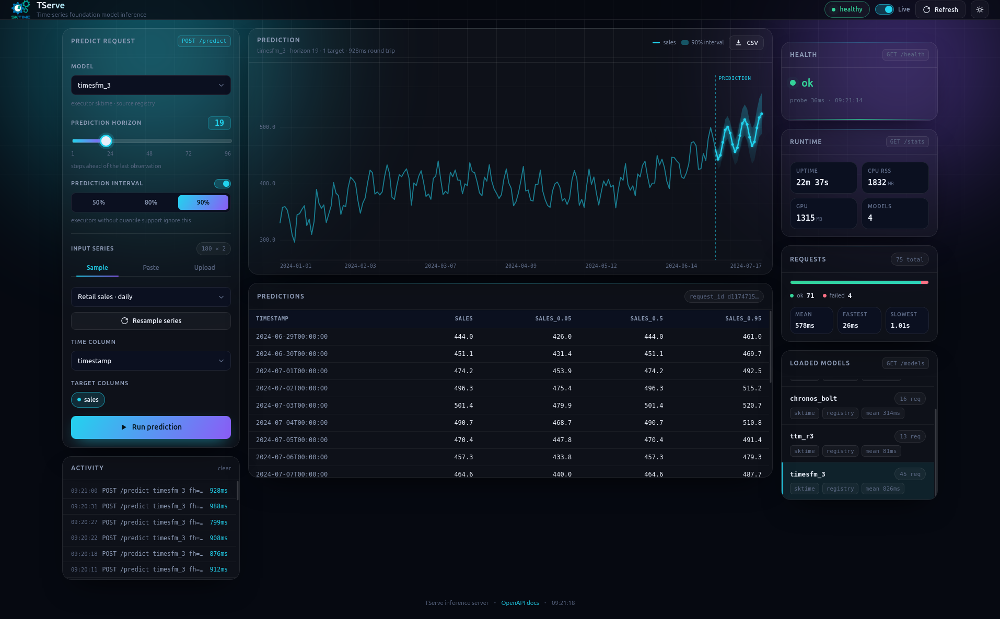

# Dashboard

The running server serves a browser console at `GET /`. It talks only to the JSON endpoints (`/health`, `/models`, `/stats`, `POST /predict`). It does not use `/predict/bytes`.

Open [http://127.0.0.1:8000/](http://127.0.0.1:8000/) after [starting a server](index.md). The process prints this URL on startup.

[`timesfm_3`](../models/timesfm3.md) forecasts retail sales with a 90% prediction interval.

{ .tserve-shot }

## What you can do

- Pick a **loaded** model (the dropdown is `GET /models`, not the full catalog)
- Set the prediction horizon (1–96 steps)
- Optionally request a prediction interval (`quantiles`) if the model supports it.
- Use a sample series (daily sales, airline, hourly energy, hourly traffic), paste CSV, or drop a CSV file (parsed in the browser)
- Choose the time column and target columns
- Run `POST /predict` and plot predictions
- Download the prediction as CSV

Health and stats cards on the right poll `GET /health` and `GET /stats`. Toggle **Live** to refresh every 5 seconds.

There is no authentication and no hosted TServe API — these URLs are the process you started.

## Live OpenAPI

Same origin, generated from the FastAPI app:

| UI | URL |
| --- | --- |
| Swagger | [http://127.0.0.1:8000/docs](http://127.0.0.1:8000/docs) |
| ReDoc | [http://127.0.0.1:8000/redoc](http://127.0.0.1:8000/redoc) |
| Schema | [http://127.0.0.1:8000/openapi.json](http://127.0.0.1:8000/openapi.json) |

Use Swagger to try `POST /predict` from the browser. The dashboard is the console; Swagger is the contract.
